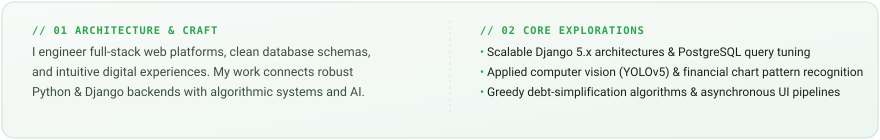
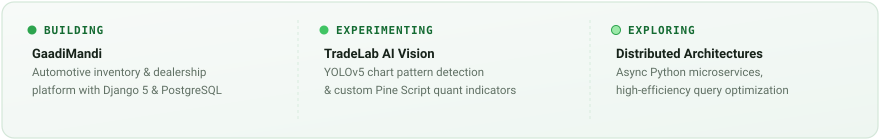
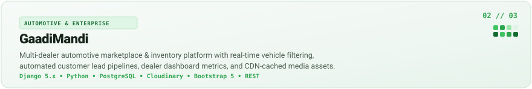
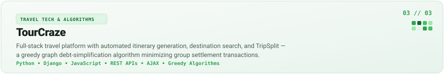
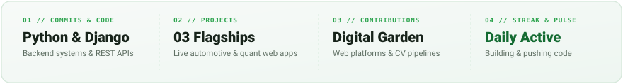

  <!-- 01 — HERO SECTION: LIVING DIGITAL GARDEN & CONTRIBUTION GRID ECOSYSTEM -->
  

 

## 02 // ABOUT

  

 

## 03 // CURRENTLY BUILDING

  

 

## 04 // SELECTED PROJECTS

  <!-- Project 01: TradeLab -->
  
  

    <a href="https://tradelab-kappa.vercel.app/" target="_blank"><code>↗ Live Demo</code></a> &nbsp;&bull;&nbsp;
    <a href="https://github.com/singhparmeet12/TradeLab" target="_blank"><code>↗ GitHub Repository</code></a> &nbsp;&bull;&nbsp;
    <a href="https://personal-portfolio-parmeet1.vercel.app/work/tradelab/" target="_blank"><code>↗ Case Study</code></a>
  

  <!-- Project 02: GaadiMandi -->
  
  

    <a href="https://car-trade-gamma.vercel.app/" target="_blank"><code>↗ Live Demo</code></a> &nbsp;&bull;&nbsp;
    <a href="https://personal-portfolio-parmeet1.vercel.app/work/gaadimandi/" target="_blank"><code>↗ Case Study</code></a>
  

  <!-- Project 03: TourCraze -->
  
  

    <a href="https://tour-craze.vercel.app/" target="_blank"><code>↗ Live Demo</code></a> &nbsp;&bull;&nbsp;
    <a href="https://github.com/singhparmeet12/TourCraze" target="_blank"><code>↗ GitHub Repository</code></a> &nbsp;&bull;&nbsp;
    <a href="https://personal-portfolio-parmeet1.vercel.app/work/tourcraze/" target="_blank"><code>↗ Case Study</code></a>
  

 

## 05 // TECH STACK

  

 

## 06 // GITHUB ACTIVITY & METRICS

  

    

  <!-- Subtle Mint Contribution Streak -->
  

 

## 07 // TERMINAL

  

 

---

## 08 // CONNECT

  

    <a href="https://github.com/singhparmeet12"><code>GitHub ↗</code></a> &nbsp;&bull;&nbsp;
    <a href="https://linkedin.com/in/parmeetsingh12" target="_blank"><code>LinkedIn ↗</code></a> &nbsp;&bull;&nbsp;
    <a href="https://personal-portfolio-parmeet1.vercel.app/" target="_blank"><code>Personal Portfolio ↗</code></a> &nbsp;&bull;&nbsp;
    <a href="mailto:parmeetssms@gmail.com"><code>parmeetssms@gmail.com ↗</code></a>
  

  
    PARMEET SINGH &bull; DIGITAL GARDEN &bull; 2026 EDITION
  

