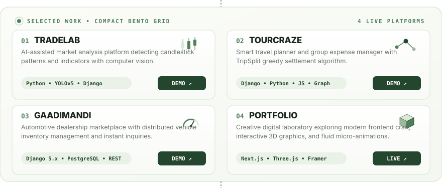

  <!-- ================================================================= -->
  <!-- 01 • ANIMATED HELLO GREETING                                      -->
  <!-- ================================================================= -->
  

  <!-- ================================================================= -->
  <!-- 02 • UNIFIED HERO BANNER (TERMINAL + FLOATING PARMEET AVATAR)    -->
  <!-- ================================================================= -->
  

  <!-- ================================================================= -->
  <!-- 03 • COMPACT 2X2 BENTO GRID PROJECTS                              -->
  <!-- ================================================================= -->
  

  <!-- COMPACT DIRECT ACTION LINKS -->
  

    <a href="https://tradelab-kappa.vercel.app/" target="_blank"><code>01 TradeLab Demo ↗</code></a> &nbsp;&bull;&nbsp;
    <a href="https://github.com/singhparmeet12/TradeLab" target="_blank"><code>TradeLab Code ↗</code></a> &nbsp;|&nbsp;
    <a href="https://tour-craze.vercel.app/" target="_blank"><code>02 TourCraze Demo ↗</code></a> &nbsp;&bull;&nbsp;
    <a href="https://github.com/singhparmeet12/TourCraze" target="_blank"><code>TourCraze Code ↗</code></a> &nbsp;|&nbsp;
    <a href="https://car-trade-gamma.vercel.app/" target="_blank"><code>03 GaadiMandi Demo ↗</code></a> &nbsp;|&nbsp;
    <a href="https://personal-portfolio-parmeet1.vercel.app/" target="_blank"><code>04 Portfolio Live ↗</code></a>
  

  <!-- ================================================================= -->
  <!-- 04 • TOOLKIT & CRAFT (I BUILD WITH)                               -->
  <!-- ================================================================= -->
  

  <!-- ================================================================= -->
  <!-- 05 • REACH OUT & RESUME ANCHOR                                    -->
  <!-- ================================================================= -->
  

  <!-- EXPLICIT ACTIONABLE CONTACT & RESUME BUTTONS -->
  

    <a href="https://personal-portfolio-parmeet1.vercel.app/resume/download/" target="_blank" rel="noopener noreferrer"><b>📄 VIEW RESUME (PDF) ↗</b></a> &nbsp;&bull;&nbsp;
    <a href="https://linkedin.com/in/parmeetsingh12" target="_blank" rel="noopener noreferrer"><b>LinkedIn ↗</b></a> &nbsp;&bull;&nbsp;
    <a href="mailto:parmeetssms@gmail.com"><b>parmeetssms@gmail.com ↗</b></a> &nbsp;&bull;&nbsp;
    <a href="https://personal-portfolio-parmeet1.vercel.app/" target="_blank" rel="noopener noreferrer"><b>Personal Portfolio ↗</b></a>
  

  
    PARMEET SINGH &bull; FULL-STACK DEVELOPER &bull; DELHI, INDIA
  

