<div align="center">

  <!-- Dynamic Animated Wavy Gradient Header -->
  

  <!-- Animated Real-Time Typing Text -->
  <a href="https://personal-portfolio-parmeet1.vercel.app/">
    
  </a>

  <br/>

  <!-- Quick Action & Social Connect Dock -->
  <p align="center">
    <a href="https://personal-portfolio-parmeet1.vercel.app/" target="_blank">
      
    </a>
    <a href="https://linkedin.com/in/parmeetsingh12" target="_blank">
      
    </a>
    <a href="mailto:parmeetssms@gmail.com">
      
    </a>
    <a href="https://personal-portfolio-parmeet1.vercel.app/resume/download/" target="_blank">
      
    </a>
  </p>

</div>

---

### 💻 Active Session Studio

<div align="center">
  
</div>

<br/>

<div align="center">
  
</div>

### 👨‍💻 About Me

```yaml
identity: Parmeet Singh
specialization: Full-Stack Web Development, Backend Architecture & AI Systems
education: B.Tech in Artificial Intelligence & Data Science
core_focus: Python, Django 5.x, Relational Database Design, Modern Frontend VFX
status: "🟢 Available for Full-Stack Developer Roles & High-Impact Engineering Contracts"
```

- 🚀 **Full-Stack Architecture**: Specialized in architecting robust, scalable web backends with **Django** and **PostgreSQL**, paired with polished, highly interactive user experiences.
- 🧠 **AI & Computer Vision**: Experienced in developing deep learning models with **YOLOv5** and **OpenCV** for automated visual detection and algorithmic analytics.
- ⚡ **Algorithmic Problem Solving**: Engineered custom algorithmic systems, such as **TripSplit** (a greedy graph debt-simplification algorithm for group expenses) and automated stock chart pattern recognition engines.
- 🎨 **Design & Craft**: Believer in high-craft aesthetics, sub-second load times, smooth micro-animations, and clean documentation.
- 🌐 **Portfolio**: Explore my interactive Day/Sunset/Night studio workspace at [personal-portfolio-parmeet1.vercel.app](https://personal-portfolio-parmeet1.vercel.app/).

<br/>

<div align="center">
  
</div>

### 🛠️ Technical Stack & Tooling

<div align="center">

#### Backend, Databases & APIs
<p align="center">
  
  
  
  
  
  
</p>

#### Frontend & UI Systems
<p align="center">
  
  
  
  
  
  
</p>

#### AI, Computer Vision & Data Science
<p align="center">
  
  
  
  
  
  
</p>

#### Cloud, DevOps & Developer Tools
<p align="center">
  
  
  
  
  
  
</p>

</div>

<br/>

<div align="center">
  
</div>

### 🌟 Featured Web Platforms & Engineering Projects

<table>
  <tr>
    <td width="50%" valign="top">
      <h3 align="center">🚗 GaadiMandi</h3>
      <p align="center">
        <b>Automotive Dealership & Vehicle Inventory Platform</b>
      </p>
      <p align="center">
        
        
        
        
      </p>
      <ul>
        <li>Multi-dealer inventory management with fast search & filter pipelines.</li>
        <li>Automated customer inquiry routing and dealer dashboard analytics.</li>
        <li>High-res media pipeline with Cloudinary optimization and CDN delivery.</li>
      </ul>
      <p align="center">
        <a href="https://car-trade-gamma.vercel.app/" target="_blank">
          
        </a>
        <a href="https://personal-portfolio-parmeet1.vercel.app/work/gaadimandi/" target="_blank">
          
        </a>
      </p>
    </td>
    <td width="50%" valign="top">
      <h3 align="center">✈️ TourCraze</h3>
      <p align="center">
        <b>Smart Travel Planner & Group Expense Platform</b>
      </p>
      <p align="center">
        
        
        
        
      </p>
      <ul>
        <li>Automated itinerary generation with destination discovery & hotel search.</li>
        <li><b>TripSplit</b>: Greedy debt-simplification algorithm minimizing settlement transactions.</li>
        <li>Interactive maps, community feeds, and responsive asynchronous UI.</li>
      </ul>
      <p align="center">
        <a href="https://tour-craze.vercel.app/" target="_blank">
          
        </a>
        <a href="https://github.com/singhparmeet12/TourCraze" target="_blank">
          
        </a>
      </p>
    </td>
  </tr>
  <tr>
    <td width="50%" valign="top">
      <h3 align="center">📈 TradeLab</h3>
      <p align="center">
        <b>AI Trading Platform & Automated Chart Pattern Detection</b>
      </p>
      <p align="center">
        
        
        
        
      </p>
      <ul>
        <li>Custom <b>YOLOv5</b> model trained on 1,450+ financial charts detecting 20 technical patterns.</li>
        <li>TradingView Pine Script indicators with EMA trend filters and ATR stop-loss logic.</li>
        <li>Historical stock analysis and next-day buy/sell probability indicators.</li>
      </ul>
      <p align="center">
        <a href="https://tradelab-kappa.vercel.app/" target="_blank">
          
        </a>
        <a href="https://github.com/singhparmeet12/TradeLab" target="_blank">
          
        </a>
      </p>
    </td>
    <td width="50%" valign="top">
      <h3 align="center">🌐 Personal Portfolio</h3>
      <p align="center">
        <b>Interactive Developer Studio with 24-Hour Lo-Fi Experience</b>
      </p>
      <p align="center">
        
        
        
        
      </p>
      <ul>
        <li>3-mode dynamic developer workspace (Day, Sunset, Night) with ambient canvas FX.</li>
        <li>Interactive "A Day in My Life" 12-scene split-screen visual journey.</li>
        <li>Built with custom modern CSS systems, dark/light themes, and cache busting.</li>
      </ul>
      <p align="center">
        <a href="https://personal-portfolio-parmeet1.vercel.app/" target="_blank">
          
        </a>
        <a href="https://personal-portfolio-parmeet1.vercel.app/resume/" target="_blank">
          
        </a>
      </p>
    </td>
  </tr>
</table>

<br/>

<div align="center">
  
</div>

### 📊 GitHub Activity & Metrics

<div align="center">

  <!-- Profile Views & Followers Badges -->
  <p align="center">
    
    <a href="https://github.com/singhparmeet12?tab=followers" target="_blank">
      
    </a>
    <a href="https://github.com/singhparmeet12?tab=repositories" target="_blank">
      
    </a>
  </p>

  <br/>

  <!-- GitHub Readme Stats & Streak Stats in Tokyo Night -->
  <table border="0">
    <tr>
      <td valign="middle" align="center">
        <a href="https://github.com/singhparmeet12">
          
        </a>
      </td>
      <td valign="middle" align="center">
        <a href="https://github.com/singhparmeet12">
          
        </a>
      </td>
    </tr>
    <tr>
      <td colspan="2" align="center">
        <a href="https://github.com/singhparmeet12">
          
        </a>
      </td>
    </tr>
  </table>

</div>

<br/>

<div align="center">
  
</div>

### 📬 Let's Connect & Build Together

<div align="center">
  <p>
    Whether you have an interesting project idea, need an experienced <b>Django / Python Full-Stack Developer</b>, or just want to chat about web architecture & AI:
  </p>

  <p>
    <a href="mailto:parmeetssms@gmail.com">
      
    </a>
    <a href="https://linkedin.com/in/parmeetsingh12" target="_blank">
      
    </a>
    <a href="https://personal-portfolio-parmeet1.vercel.app/" target="_blank">
      
    </a>
  </p>

  <!-- Animated Bottom Wave Footer -->
  

  <p align="center">
    <i>"Crafting digital experiences at the intersection of robust engineering and refined design."</i>
  </p>

</div>
