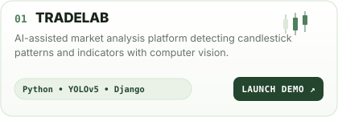
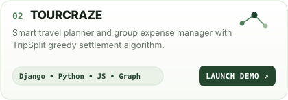
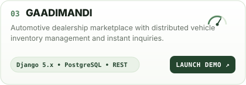
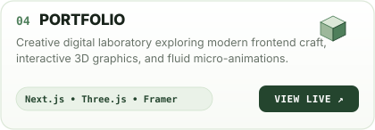

  <!-- ═══════════════════════════════════════════════════════════ -->
  <!-- 01 • ANIMATED HELLO GREETING                                -->
  <!-- ═══════════════════════════════════════════════════════════ -->
  

  <!-- ═══════════════════════════════════════════════════════════ -->
  <!-- 02 • UNIFIED HERO BANNER                                    -->
  <!-- ═══════════════════════════════════════════════════════════ -->
  

  <!-- HERO CLICKABLE ACTION BUTTONS -->
  

    
    &nbsp;&nbsp;
    
    &nbsp;&nbsp;
    
    &nbsp;&nbsp;
    
  

  <!-- ═══════════════════════════════════════════════════════════ -->
  <!-- 03 • BENTO GRID PROJECTS                                    -->
  <!-- ═══════════════════════════════════════════════════════════ -->
  

  <!-- ROW 1 -->
  

    
    
  

  <!-- ROW 2 -->
  

    
    
  

  <!-- REPO QUICK LINKS -->
  

    <a href="https://tradelab-kappa.vercel.app/" target="_blank"><code>01 TradeLab Demo ↗</code></a> &nbsp;•&nbsp;
    <a href="https://github.com/singhparmeet12/TradeLab" target="_blank"><code>TradeLab Repo ↗</code></a> &nbsp;|&nbsp;
    <a href="https://tour-craze.vercel.app/" target="_blank"><code>02 TourCraze Demo ↗</code></a> &nbsp;•&nbsp;
    <a href="https://github.com/singhparmeet12/TourCraze" target="_blank"><code>TourCraze Repo ↗</code></a> &nbsp;|&nbsp;
    <a href="https://car-trade-gamma.vercel.app/" target="_blank"><code>03 GaadiMandi Demo ↗</code></a> &nbsp;|&nbsp;
    <a href="https://personal-portfolio-parmeet1.vercel.app/" target="_blank"><code>04 Portfolio Live ↗</code></a>
  

  <!-- ═══════════════════════════════════════════════════════════ -->
  <!-- 04 • TOOLKIT & CRAFT                                        -->
  <!-- ═══════════════════════════════════════════════════════════ -->
  

  <!-- ═══════════════════════════════════════════════════════════ -->
  <!-- 05 • REACH OUT & CONNECT                                    -->
  <!-- ═══════════════════════════════════════════════════════════ -->
  

  <!-- CLICKABLE CONTACT CHIPS -->
  

    
    &nbsp;
    
    &nbsp;
    
    &nbsp;
    
  

  <!-- FOOTER -->
  

    <a href="https://personal-portfolio-parmeet1.vercel.app/resume/download/" target="_blank" rel="noopener noreferrer"><b>📄 VIEW RESUME (PDF) ↗</b></a> &nbsp;•&nbsp;
    <a href="https://linkedin.com/in/parmeetsingh12" target="_blank" rel="noopener noreferrer"><b>LinkedIn ↗</b></a> &nbsp;•&nbsp;
    <a href="mailto:parmeetssms@gmail.com"><b>parmeetssms@gmail.com ↗</b></a> &nbsp;•&nbsp;
    <a href="https://personal-portfolio-parmeet1.vercel.app/" target="_blank" rel="noopener noreferrer"><b>Personal Portfolio ↗</b></a>
  

  
    PARMEET SINGH • FULL-STACK DEVELOPER • DELHI, INDIA
  

