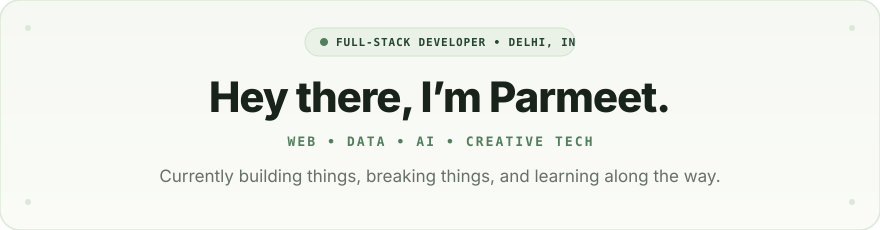
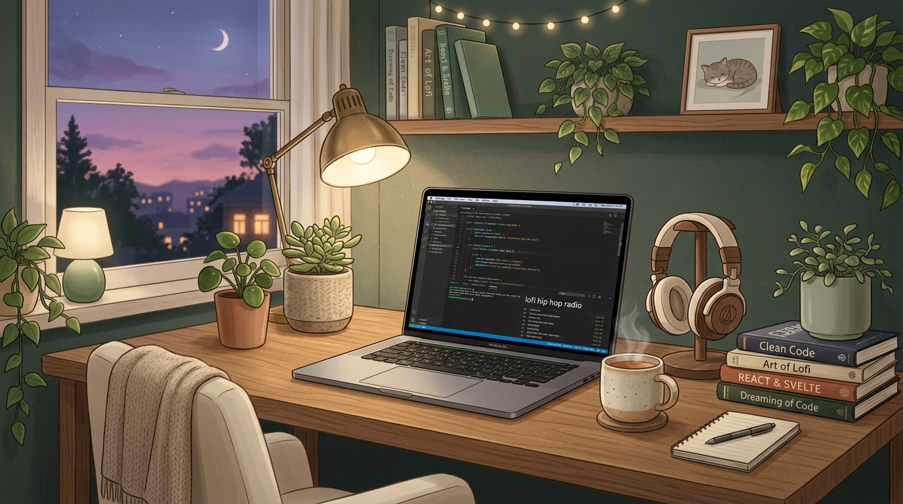
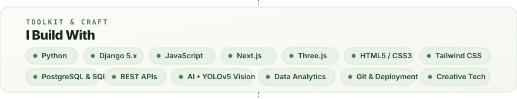
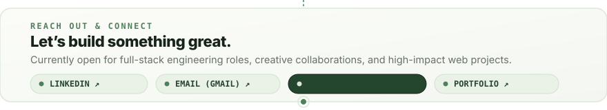

  <!-- ================================================================= -->
  <!-- 01 • GREETING & ANIMATED HELLO                                    -->
  <!-- ================================================================= -->
  

  

   

  <!-- ================================================================= -->
  <!-- 02 • COZY LOFI WORKSPACE BANNER                                   -->
  <!-- ================================================================= -->
  

   

  <!-- ================================================================= -->
  <!-- 03 • SELECTED PROJECTS (01 - 04)                                  -->
  <!-- ================================================================= -->

  <!-- PROJECT 01: TRADELAB -->
  
  

    <a href="https://tradelab-kappa.vercel.app/" target="_blank"><code>↗ View Live Demo</code></a> &nbsp;&bull;&nbsp;
    <a href="https://github.com/singhparmeet12/TradeLab" target="_blank"><code>↗ GitHub Repository</code></a>
  

  <!-- PROJECT 02: TOURCRAZE -->
  
  

    <a href="https://tour-craze.vercel.app/" target="_blank"><code>↗ View Live Demo</code></a> &nbsp;&bull;&nbsp;
    <a href="https://github.com/singhparmeet12/TourCraze" target="_blank"><code>↗ GitHub Repository</code></a>
  

  <!-- PROJECT 03: GAADIMANDI -->
  
  

    <a href="https://car-trade-gamma.vercel.app/" target="_blank"><code>↗ View Live Demo</code></a>
  

  <!-- PROJECT 04: PERSONAL PORTFOLIO -->
  
  

    <a href="https://personal-portfolio-parmeet1.vercel.app/" target="_blank"><code>↗ View Live Site</code></a> &nbsp;&bull;&nbsp;
    <a href="https://github.com/singhparmeet12/Personal-Portfolio" target="_blank"><code>↗ GitHub Repository</code></a>
  

   

  <!-- ================================================================= -->
  <!-- 04 • TOOLKIT & CRAFT (I BUILD WITH)                               -->
  <!-- ================================================================= -->
  

   

  <!-- ================================================================= -->
  <!-- 05 • CONTACT & RESUME (LET'S CONNECT)                             -->
  <!-- ================================================================= -->
  

  <!-- EXPLICIT ACTIONABLE LINKS -->
  

    <a href="https://personal-portfolio-parmeet1.vercel.app/resume/download/" target="_blank" rel="noopener noreferrer"><b>📄 VIEW RESUME (PDF) ↗</b></a> &nbsp;&bull;&nbsp;
    <a href="https://linkedin.com/in/parmeetsingh12" target="_blank" rel="noopener noreferrer"><b>LinkedIn ↗</b></a> &nbsp;&bull;&nbsp;
    <a href="mailto:parmeetssms@gmail.com"><b>parmeetssms@gmail.com ↗</b></a> &nbsp;&bull;&nbsp;
    <a href="https://personal-portfolio-parmeet1.vercel.app/" target="_blank" rel="noopener noreferrer"><b>Personal Portfolio ↗</b></a>
  

  
    PARMEET SINGH &bull; FULL-STACK DEVELOPER &bull; DELHI, INDIA
  

