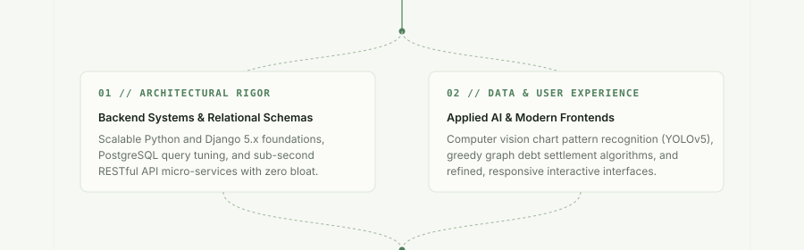
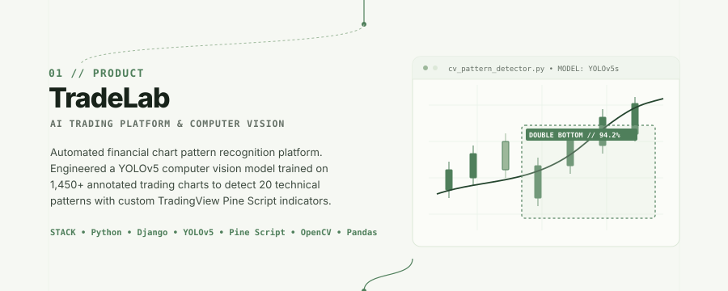
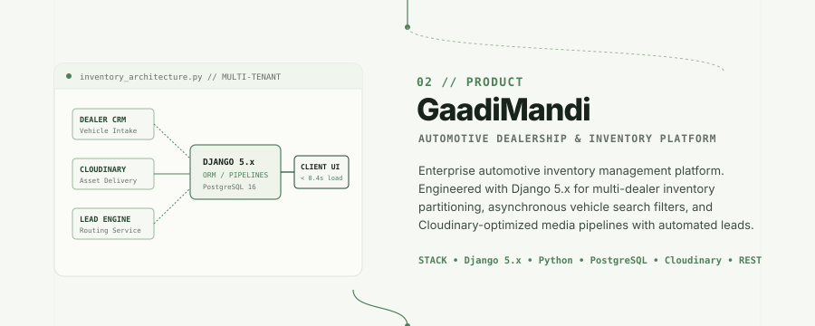
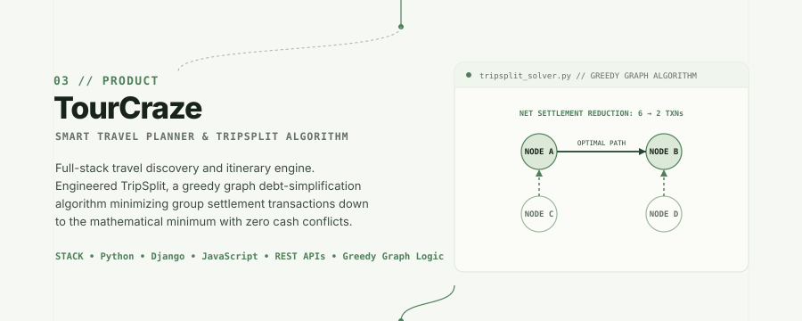
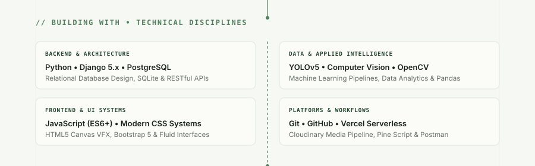
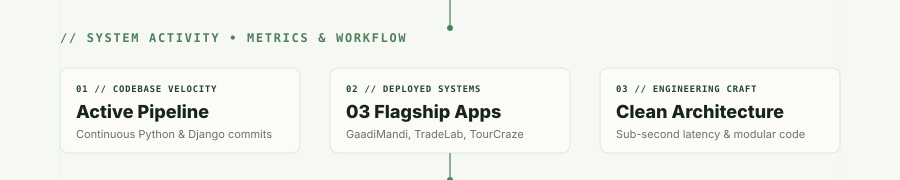
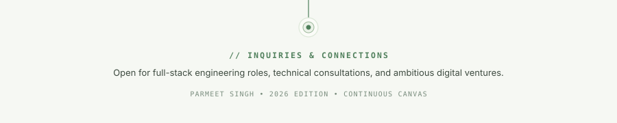

  <!-- ================================================================= -->
  <!-- PARMEET SINGH — LIVING DIGITAL CANVAS (CONTINUOUS ARCHITECTURE)   -->
  <!-- ================================================================= -->

  <!-- 01: HERO CANVAS -->
  <!--
  --><!-- 02: IDENTITY & ARCHITECTURE -->
  <!--
  --><!-- 03: PROJECT 01 — TRADELAB (AI TRADING & COMPUTER VISION) -->
  <!--
  --><!-- 04: PROJECT 02 — GAADIMANDI (AUTOMOTIVE PLATFORM) -->
  <!--
  --><!-- 05: PROJECT 03 — TOURCRAZE (TRAVEL PLANNER & TRIPSPLIT) -->
  <!--
  --><!-- 06: TECHNICAL DISCIPLINES & ECOSYSTEM -->
  <!--
  --><!-- 07: SYSTEM ACTIVITY & TELEMETRY -->
  <!--
  --><!-- 08: CONNECT & TERMINAL ANCHOR -->
  

  <!-- INTERACTIVE ACTION BAR & DIRECT LINKS -->
  

    <a href="https://linkedin.com/in/parmeetsingh12" target="_blank" rel="noopener noreferrer"><code>LinkedIn ↗</code></a> &nbsp;&bull;&nbsp;
    <a href="https://personal-portfolio-parmeet1.vercel.app/" target="_blank" rel="noopener noreferrer"><code>Portfolio ↗</code></a> &nbsp;&bull;&nbsp;
    <a href="https://github.com/singhparmeet12?tab=repositories" target="_blank" rel="noopener noreferrer"><code>Repositories ↗</code></a> &nbsp;&bull;&nbsp;
    <a href="mailto:parmeetssms@gmail.com"><code>parmeetssms@gmail.com ↗</code></a>
  

  

    <small>
      <a href="https://tradelab-kappa.vercel.app/" target="_blank"><b>TradeLab Demo</b></a> &nbsp;|&nbsp;
      <a href="https://github.com/singhparmeet12/TradeLab" target="_blank">TradeLab Code</a> &nbsp;&bull;&nbsp;
      <a href="https://car-trade-gamma.vercel.app/" target="_blank"><b>GaadiMandi Demo</b></a> &nbsp;&bull;&nbsp;
      <a href="https://tour-craze.vercel.app/" target="_blank"><b>TourCraze Demo</b></a> &nbsp;|&nbsp;
      <a href="https://github.com/singhparmeet12/TourCraze" target="_blank">TourCraze Code</a>
    </small>
  

  
    PARMEET SINGH &bull; DIGITAL CRAFTSMANSHIP &bull; 2026
  

