  <!-- 01 • HERO BANNER -->
    

  <!-- 02 • ACTION BUTTONS (ALL WITH TARGET=_BLANK FOR NEW TAB) -->
  
  &nbsp;&nbsp;
  
  &nbsp;&nbsp;
  
  &nbsp;&nbsp;
  
    

  <!-- 03 • TECH STACK -->
    

  <!-- 04 • FEATURED PROJECTS (CLICK CARD DIRECTLY LAUNCHES DEMO) -->
    

  <!-- ROW 1: TradeLab & TourCraze -->
  
  &nbsp;
  
    

  <!-- ROW 2: GaadiMandi & Portfolio -->
  
  &nbsp;
  
    

  <!-- 05 • CONNECT SECTION -->
    

  <!-- CLICKABLE CONNECT CHIPS (3 CLEAN, SPACIOUS CHIPS - CENTERED) -->
  
  &nbsp;&nbsp;&nbsp;&nbsp;
  
  &nbsp;&nbsp;&nbsp;&nbsp;
  
    

  <!-- 06 • FOOTER BAR -->
  

